## Propmt generator

### Overview

This project, named the Prompt Generator, is a Flask web application designed to leverage the Generative AI API. It allows users to interact with a generative model to create structured prompts or explore random prompts. The web interface provides a seamless experience for users to generate creative prompts based on their input or discover unique prompts at random.

### Project Structure

```text
app
     - instruction/
          - file
     - static/
          - icon/
              - file
          - style/
               - file
          - font/
               - file
          - script/
               - file
     - template/
          - file
     - .env
     - app.py
```

### Installation

To run this project locally, follow these steps:

1. Clone the repository:

   ```bash
   git clone https://github.com/1999AZZAR/GPT-Advace-prompt-generator
   ```

2. Navigate to the project directory.

3. Install the required dependencies:

   ```bash
   pip install flask python-dotenv google-generativeai
   ```

### Configuration

1. Obtain a Generative AI API key by following the instructions [here](https://makersuite.google.com/app/apikey).

2. Add your API key to the `.env` file:

   ```bash
   GENAI_API_KEY=your_api_key_here
   ```

### Usage

1. Run the Flask application:

   ```bash
   python app.py
   ```

2. Open your web browser and go to [http://localhost:5000](http://localhost:5000).

3. **Structured Prompt Generation:** Enter text in the input box on the homepage and click "Generate" to receive a structured prompt based on your input.

4. **Random Prompt Exploration:** Click "Random" to explore a randomly generated prompt without providing specific input.

### Files

- **app.py:** The main Flask application file. It handles routing and connects the web interface to the generative model.

- **generative_model.py:** This file contains the code for the generative model. It includes functions for generating responses and random prompts.

- **template/generator.html:** The HTML template for the web interface. It includes the structure for user input, displaying responses, and styling.

### Purpose

The primary purpose of this project is to create a user-friendly interface for interacting with the Generative AI API. It empowers users to effortlessly generate both structured and random prompts, providing a versatile tool for creative exploration.

### Flowchart

```mermaid
graph TD
    A[User] -->|1. Enters text| B[Web Interface]
    B -->|2. Sends request| C[app.py]
    C -->|3. Processes input| D[generative_model.py]
    D -->|4. Generates response| E[Web Interface]
    E -->|5. Displays response| B

    style A fill:#3D065A,stroke:#3D065A,stroke-width:2px;
    style B fill:#B51A62,stroke:#B51A62,stroke-width:2px;
    style C fill:#BF3131,stroke:#BF3131,stroke-width:2px;
    style D fill:#BF3131,stroke:#BF3131,stroke-width:2px;
    style E fill:#B51A62,stroke:#B51A62,stroke-width:2px;
```



### Dependencies

- Flask: [Flask Documentation](https://flask.palletsprojects.com/)
- python-dotenv: [python-dotenv Documentation](https://pypi.org/project/python-dotenv/)
- google-generativeai: [Generative AI Documentation](https://ai.google.dev/docs)

### Contributors

- [azzar](https://github.com/1999AZZAR)

### License

This project is licensed under [License Name]. See the [LICENSE.md](LICENSE.md) file for details.
